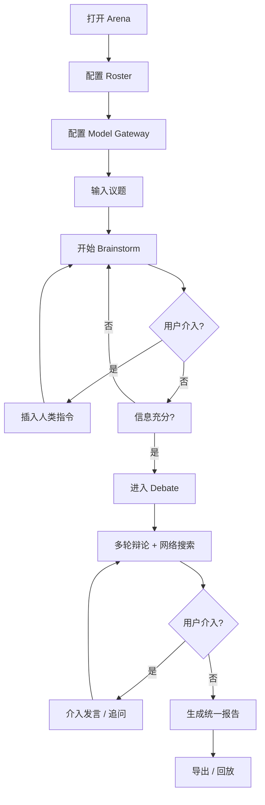

# Group Debate Agent Hub — 产品需求文档（PRD）

## 1. 产品概述

Group Debate Agent Hub 是一个**多 Agent 实时辩论指挥台**，把多个具备独立人设的 AI Agent 组成"智囊团"，围绕用户提出的问题先做发散式 brainstorming，再进入多轮正反辩论，期间可让 Agent 并行检索网络补充论据，并允许人类随时介入纠偏或追问，最终自动汇总出一份**结构化的统一结论报告**。

- 解决"单个 LLM 视角单一、缺乏对抗性推演"的问题
- 面向产品决策者、研究者、战略分析者、教育者等需要**多视角推演**的群体
- 目标价值：把"开会讨论 + 资料检索 + 决策对齐"三件事压在一个可观察的实时界面里

## 2. 核心功能

### 2.1 用户角色

本产品为单用户本地工具，无需登录注册。所有数据保存在浏览器 `localStorage`。

| 角色 | 入口 | 核心权限 |
|------|------|---------|
| 主持人（用户本人） | 默认 | 配置 Agent 团、提出议题、介入辩论、导出报告 |

### 2.2 功能模块

1. **总览台 (Arena)**：左侧 Agent 团、右侧实时事件流 / 辩论文本流，是主舞台
2. **议题工作台 (Question Workbench)**：输入议题、设定阶段（brainstorm / debate）、决定何时进入下一阶段
3. **Agent 团配置 (Roster)**：设定人数（2–8）、选择预置人设或自定义人设、调整 Agent 倾向
4. **模型接入配置 (Model Gateway)**：配置 LLM Provider、API Key、Base URL、Model 名、温度等
5. **报告中心 (Report)**：自动汇总的全场结论，可展开每个论点的支持/反对明细，可导出 Markdown

### 2.3 页面详情

| 页面 / 模块 | 子模块 | 功能描述 |
|-------------|--------|----------|
| 总览台 Arena | Agent 列阵 | 圆形/弧形排列展示所有 Agent 头像、人设、当前状态（idle / thinking / searching / speaking / paused） |
| 总览台 Arena | 实时事件流 | 时间轴显示每个 Agent 的"思考中 / 检索中 / 发言中 / 引用证据"等事件，附"插入人类指令"入口 |
| 总览台 Arena | 辩论文本流 | 阶段标签清晰区分 brainstorm / debate，发言卡片显示人设头像、立场、引用来源 |
| 议题工作台 | 议题输入 | 多行文本框，支持附加背景资料（可选） |
| 议题工作台 | 阶段控制 | 大按钮：开始 Brainstorm / 进入 Debate / 暂停 / 继续 / 强制结束 / 重新开始 |
| Agent 团配置 | 人数滑杆 | 2–8 人，支持新增 / 删除 |
| Agent 团配置 | 人设选择 | 预置库（理想主义者 / 怀疑论者 / 工程师 / 用户体验派 / 数据极客 / 风险厌恶者 / 战略家 / 道德卫士），可在此基础上编辑 |
| Agent 团配置 | 自定义人设 | 名称 + 立场描述 + 语气 + 关注点 + 头像颜色（自动生成） |
| 模型接入配置 | Provider 列表 | 支持 OpenAI / Anthropic / 自定义 OpenAI 兼容端点（DeepSeek、Moonshot、Ollama 等） |
| 模型接入配置 | 参数面板 | API Key、Base URL、Model 名、Temperature、Max Tokens、是否启用"网络搜索" |
| 模型接入配置 | 测试连接 | 一次 ping 测试当前配置是否可用 |
| 报告中心 | 结论摘要 | TL;DR + 关键分歧 + 共识点 + 行动建议 |
| 报告中心 | 论点明细 | 每个论点的支持派 / 反对派、证据来源、引用原文 |
| 报告中心 | 时间线回放 | 折叠面板：按时间轴回放本次 brainstorming + debate 全过程 |
| 报告中心 | 导出 | 下载 Markdown 报告 / 复制到剪贴板 |

## 3. 核心流程

### 3.1 主流程

1. 用户打开应用 → 进入 **Arena**，默认显示 3 个示例 Agent 占位
2. 用户在 **Roster** 配置 Agent 团（人数 / 人设），在 **Model Gateway** 接入模型（可保存多份 Provider 预设）
3. 用户在 **Question Workbench** 输入议题，可附加背景资料
4. 点击「开始 Brainstorm」→ 所有 Agent 围绕议题并发地发散想法，事件流实时滚动，用户可随时「插入指令」对单个或全体 Agent 纠偏
5. 用户点击「进入 Debate」→ 系统按立场自动划分为正反双方（或 N 方），进入多轮辩论；每轮中 Agent 可触发"网络搜索"补强论点（搜索结果以 mock 形式呈现并标注来源）
6. 辩论进行中，用户可随时「介入发言」或「要求某 Agent 继续阐述」；也可「强制进入下一轮」或「暂停」
7. 用户点击「生成报告」→ 系统汇总所有 brainstorm 观点 + 辩论论据 + 共识/分歧，输出**结构化统一结论**
8. 用户可在报告中心展开论据、导出 Markdown

### 3.2 流程图

## 4. 用户界面设计

### 4.1 设计风格

- **主题**：**"辩论场指挥中心"**——暗色为主，舞台聚光感，参考"指挥塔 / 议事圆桌"意象
- **主色**：
  - 背景：`#0B0F1A`（深空蓝黑）
  - 强调色 1：`#E8B14C`（议事金，标题/重点）
  - 强调色 2：`#5FE0C7`（思辨青，AI 状态/数据）
  - 强调色 3：`#F47174`（对抗红，反对派/警告）
  - 强调色 4：`#9A8CFF`（人类紫，用户指令）
- **字体**：
  - 标题：`Fraunces`（衬线，议事金权威感）
  - 正文：`Inter Tight`（紧凑无衬线，UI 阅读）
  - 中文：`Noto Serif SC` + `Noto Sans SC`（与英文配对，衬线/无衬线）
- **按钮**：圆角 8px，悬浮有 0.06em 字距微扩张 + 金色细描边
- **布局**：左侧固定 Roster 抽屉 + 中间 Arena + 右侧 Report 抽屉；顶部 Stage Control 阶段条
- **图标**：lucide-react 线性图标，金色 stroke
- **动效**：
  - 阶段切换时主舞台有 1.2s 文字 mask 擦除
  - Agent 状态变化有圆形 pulse + 颜色呼吸
  - 事件流新条目从顶部"滑入 + 渐显"，旧条目 fade-out
  - 报告展开有"卷轴展开"动画（高度 + 渐显）
- **质感**：背景叠加 SVG 噪点 + 渐变网格，整体偏"现代议事厅"而非"赛博朋克"

### 4.2 页面设计概述

| 页面 | 模块 | UI 元素 |
|------|------|---------|
| Arena | Agent 列阵 | 圆形头像 + 人设名 + 立场 chip，圆周外侧有 4px 状态环（金/青/红/紫），hover 显示完整 persona 卡片 |
| Arena | 事件流 | 时间轴左侧，每条事件 1 行：时间戳 + Agent 头像 + 动词 chip（"正在思考"/"引用来源"） |
| Arena | 辩论文本流 | 发言卡片圆角 12px，背景半透明白 8%，左侧 4px 立场色条，支持"展开论据 / 折叠" |
| Question Workbench | 议题输入 | 衬线大字 24px，金色 placeholder，焦点时下方金色细线下划线动效 |
| Question Workbench | 阶段控制 | 4 个圆角大按钮并排，金色实心 = 主操作（开始/进入），描边 = 次操作（暂停/继续） |
| Roster | 人数滑杆 | 2–8 等距圆点，当前值金色填充，hover 显示该位 Agent 简卡 |
| Roster | 人设库 | 8 个预置卡片，2 行 × 4 列网格，选中后右侧抽屉显示完整描述 + 编辑 |
| Model Gateway | Provider 卡片 | 列表形式，每条显示 Provider 名称 + 端点 + 已选 Model，支持"测试连接"小图标按钮 |
| Report | 结论摘要 | 4 个 section（TL;DR / 分歧 / 共识 / 行动），衬线大标题 + 编号小标题 |
| Report | 论点明细 | 折叠树，论据卡片显示引用来源（mock URL 域名 + 标题） |

### 4.3 响应式

- **桌面优先**：1280px+ 三栏布局
- **平板（768–1280px）**：Roster 折叠为左侧浮窗按钮，Report 抽屉可隐藏
- **手机（<768px）**：单列堆叠，Agent 阵列变 2 列网格，事件流与发言流 tab 切换

### 4.4 3D 场景

本项目**不强制 3D**，但 Agent 头像使用 CSS 渐变 + 玻璃拟态作为"舞台聚光"质感，避免使用 3D 球体或 Three.js 以保持性能与简洁。
