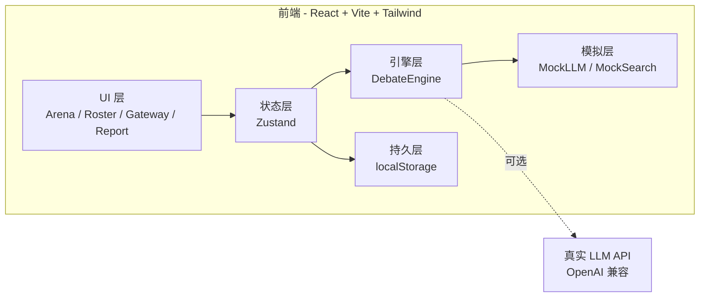
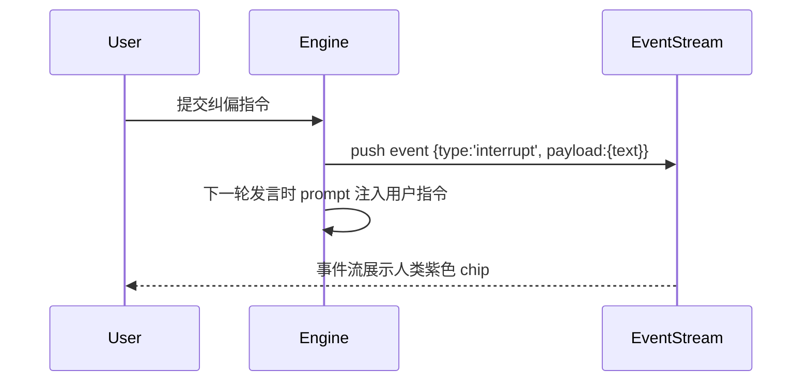
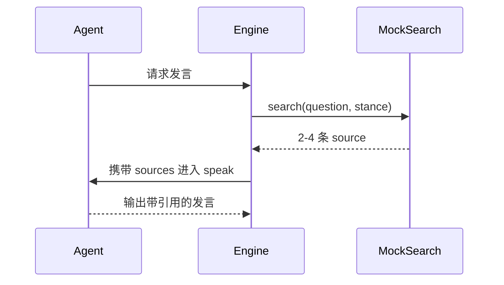

# Group Debate Agent Hub — 技术架构文档

## 1. 架构设计



> 默认使用 **MockLLM / MockSearch** 生成拟真 Agent 行为；用户可在 Model Gateway 填入 API Key 后切换到真实 API。**本期交付使用 Mock 模式以保证零依赖可运行**。

## 2. 技术栈

- **前端框架**：React@18 + TypeScript
- **构建工具**：Vite@5
- **样式**：TailwindCSS@3 + CSS Variables（自定义主题色）
- **状态管理**：Zustand@4（含 persist 中间件）
- **图标**：lucide-react
- **动画**：Framer Motion@11（阶段切换、列表入场、报告展开）
- **字体**：Google Fonts（Fraunces / Inter Tight / Noto Serif SC / Noto Sans SC）
- **后端**：无（纯前端 + Mock；预留 `LLMClient` 接口可对接真实 Provider）
- **数据存储**：浏览器 `localStorage`（Zustand persist）
- **代码规范**：ESLint + Prettier（最小化配置）

## 3. 路由定义

| 路由 | 用途 |
|------|------|
| `/` | **Arena** 总览台（默认入口，整合所有功能模块） |

> 本项目设计为**单页指挥台**：所有模块通过抽屉 / 浮层 / Tab 切换，**不做多路由跳转**以减少状态割裂感。

## 4. 目录结构

```
group-debate-hub/
├── .trae/documents/         # PRD + 技术架构
├── public/                  # 静态资源
├── src/
│   ├── components/
│   │   ├── arena/           # Arena 子组件（AgentRing / EventStream / SpeechStream）
│   │   ├── roster/          # Roster 配置
│   │   ├── gateway/         # Model Gateway
│   │   ├── question/        # 议题工作台
│   │   ├── report/          # 报告中心
│   │   └── shared/          # 通用组件（Button / Drawer / Chip / Modal）
│   ├── engine/
│   │   ├── DebateEngine.ts  # 核心调度器
│   │   ├── PhaseMachine.ts  # 阶段状态机
│   │   ├── MockLLM.ts       # 模拟 LLM 输出
│   │   ├── MockSearch.ts    # 模拟网络搜索
│   │   └── ReportBuilder.ts # 报告生成器
│   ├── store/
│   │   ├── useRosterStore   # Agent 团状态
│   │   ├── useGatewayStore  # 模型配置状态
│   │   ├── useSessionStore  # 当前议题/阶段/事件流
│   │   └── useReportStore   # 报告状态
│   ├── data/
│   │   ├── personas.ts      # 8 个预置人设
│   │   └── prompts.ts       # 模拟 LLM 的 prompt 模板
│   ├── types/               # TS 类型定义
│   ├── styles/
│   │   ├── globals.css      # 全局 + 主题变量
│   │   └── fonts.css        # 字体引入
│   ├── App.tsx
│   └── main.tsx
├── index.html
├── package.json
├── tailwind.config.js
├── tsconfig.json
└── vite.config.ts
```

## 5. 核心数据结构（TypeScript）

```ts
type Phase = 'idle' | 'brainstorm' | 'debate' | 'report';

type AgentStance = 'pro' | 'con' | 'neutral';
type AgentStatus = 'idle' | 'thinking' | 'searching' | 'speaking' | 'paused';

interface Persona {
  id: string;
  name: string;
  emoji: string;
  color: string;        // 头像渐变色 hex
  oneLiner: string;     // 一句话立场
  description: string;  // 详细人设
  focus: string[];      // 关注点标签
  tone: string;         // 语气描述
  stance: AgentStance;  // 默认立场
}

interface RosterAgent {
  id: string;
  personaId: string;
  customizations?: Partial<Persona>;
  status: AgentStatus;
}

interface DebateEvent {
  id: string;
  ts: number;
  agentId: string;
  type: 'think' | 'speak' | 'search' | 'cite' | 'interrupt' | 'system';
  payload: {
    text?: string;
    sources?: { title: string; url: string; snippet: string }[];
    round?: number;
  };
}

interface Speech {
  id: string;
  round: number;
  agentId: string;
  stance: AgentStance;
  text: string;
  sources?: { title: string; url: string; snippet: string }[];
  ts: number;
}

interface Session {
  id: string;
  question: string;
  background?: string;
  phase: Phase;
  events: DebateEvent[];
  speeches: Speech[];
  currentRound: number;
  maxRounds: number;
  startedAt: number;
}

interface FinalReport {
  sessionId: string;
  tldr: string;
  consensus: string[];
  disagreements: string[];
  actions: string[];
  arguments: {
    point: string;
    supporters: string[];
    opposers: string[];
    evidence: { title: string; url: string; snippet: string }[];
  }[];
}
```

## 6. 核心引擎设计

### 6.1 PhaseMachine

简单的状态机：

```ts
type PhaseEvent =
  | { type: 'START_BRAINSTORM' }
  | { type: 'ENTER_DEBATE' }
  | { type: 'PAUSE' }
  | { type: 'RESUME' }
  | { type: 'NEXT_ROUND' }
  | { type: 'GENERATE_REPORT' }
  | { type: 'RESET' };
```

转换规则：`idle → brainstorm → debate → report`；任何阶段都允许 `pause / resume`。

### 6.2 DebateEngine

核心调度循环，使用 `setTimeout` 链模拟并发（避免真多线程复杂度）：

1. **Brainstorm 阶段**：遍历 Roster，对每个 Agent 串行触发 `MockLLM.brainstorm(agent, question)`，每次输出 → 写入事件流 → 间隔 800–1800ms
2. **Debate 阶段**：
   - 轮次开始：所有 Agent 进入 `thinking` 状态
   - 随机/正反顺序：每个 Agent 依次发言，发言前 30% 概率先触发 `MockSearch` 检索补强
   - 整轮发言结束 → 等待用户确认或自动进入下一轮
3. **用户介入**：发送 `interrupting` 事件到事件流；下一轮发言前插入用户文本作为"主持人发言"被 Agent 引用
4. **报告生成**：扫描全部 Speech + Events → 调 `ReportBuilder` 输出结构化结论

### 6.3 MockLLM

基于人设 + 议题的**模板化生成**（无需调用真实 API）：

- 维护 `personas.ts` 8 个预置人设
- `prompts.ts` 维护 brainstorm / debate / search-result 模板
- 生成时按人设立场（pro / con / neutral）+ 关注点 + 语气组合文字
- 模拟"思考"延迟 600–1500ms，"搜索"延迟 1200–2200ms，"发言"延迟 400–900ms

### 6.4 MockSearch

- 维护一个 30 条"假新闻 / 假报告"语料库（涵盖科技、商业、社会议题）
- 根据议题关键词 + Agent 立场倾向返回 2–4 条结果（含 title / url / snippet）
- 强调"看起来真实"——url 形如 `https://www.theverge.com/2026/...`、`https://arxiv.org/abs/2603...`

### 6.5 ReportBuilder

- 聚类所有 Speech 为 4–8 个"核心论点"
- 统计每个论点的 supporter / opposer Agent
- 提取共识点（≥70% 同意）/ 分歧点（>40% 反对）
- 生成 TL;DR（取立场最居中 Agent 的总结 + 用户议题关键词）
- 输出 Markdown 字符串供下载/复制

## 7. 关键交互流程

### 7.1 用户在 Brainstorm 中"插入指令"



### 7.2 辩论中"网络搜索"



## 8. 性能与可维护性

- 事件流限制最多 500 条，超出滚动丢弃
- 发言列表分页/虚拟滚动（>200 条时启用 react-window，本期不强制）
- DebateEngine 通过 `AbortController` 支持停止
- 状态持久化使用 Zustand `persist` 中间件（key: `gd-hub:v1`）
- 所有类型集中 `src/types/index.ts`，组件 props 强类型

## 9. 未来扩展

- 接入真实 LLM（OpenAI / Anthropic / DeepSeek）
- 真实 Web Search（SerpAPI / Tavily / Bing）
- 多议题并行 Session
- 报告导出 PDF（`react-pdf` 或后端 `puppeteer`）
- 团队协作（WebSocket 同步）
- 录音回放（基于事件流生成"时间线音频解说"）
