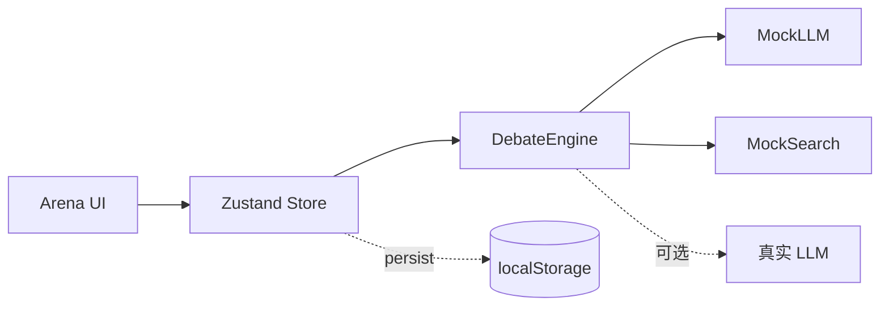

# Group Debate Agent Hub · 议事厅

> **多 Agent 实时辩论指挥台** — 把多个具备独立人设的 AI Agent 组成"智囊团"，围绕用户提出的问题先做发散式 brainstorming，再进入多轮正反辩论，期间可让 Agent 并行检索网络补充论据，并允许人类随时介入纠偏或追问，最终自动汇总出一份**结构化的统一结论报告**。

  

## ✨ 核心特性

- 🎭 **8 套预置人设** — 理想主义者 / 怀疑论者 / 工程师 / 体验派 / 数据极客 / 风险厌恶者 / 战略家 / 道德卫士
- 🛠 **自定义人设** — 名称、立场、语气、关注点、立场（pro / con / neutral）实时编辑
- 👥 **群组大小 2–8** — 拖动 / 点选调节，自动按预置池补全
- 💡 **Brainstorm 阶段** — 串行发散，事件流 + 发言流同步滚动
- 🗡 **Debate 阶段** — 可选 2/3/4/5 轮，每轮按立场对抗推演
- 🌐 **网络搜索补强** — 每个 Agent 发言前 55% 概率触发检索，引用 2 条拟真资料
- 🚨 **人类介入** — 任意时刻输入指令纠偏，事件流以紫标 chip 呈现
- ⏯ **过程控制** — 暂停 / 继续 / 强制结束 / 重新开始，可一直进行
- ⚙ **模型接入** — 6 种 Provider 模板（OpenAI / Anthropic / DeepSeek / Moonshot / Ollama / Custom）
- 📄 **统一结论报告** — TL;DR + 共识 / 分歧 / 论点明细 / 行动建议，支持 Markdown 导出
- 💾 **本地持久化** — 议题、阶段、事件、报告均存入 `localStorage`，刷新不丢

## 🎬 快速开始

```bash
pnpm install
pnpm dev
# → http://localhost:5173
```

构建生产版本：
```bash
pnpm build
pnpm preview
```

## 🏛 界面导览

```
┌────────────────────────────────────────────────────────────────┐
│  Group Debate Hub · 议事厅                            arena ready│
├────────────────────────────────────────────────────────────────┤
│  [指挥台]  开始 Brainstorm │ 直接进入 Debate │ 暂停 │ 报告  ...  │
├──────────────────────────────────────┬─────────────────────────┤
│  议题工作台 (问题 + 背景 + 介入)      │  Roster  速览           │
│  ┌──────── Agent 列阵 ────────┐      │  Gateway 速览           │
│  │   ✦        ⚙        ◇      │      │  Report  速览           │
│  └─────────────────────────────┘      │                         │
│  ┌─实时事件流──┐  ┌──发言与论据──┐    │                         │
│  │ think/cite  │  │ 立场色条卡片 │    │                         │
│  └─────────────┘  └─────────────┘    │                         │
└──────────────────────────────────────┴─────────────────────────┘
```

每个抽屉（Roster / Gateway / Report）可独立展开为右侧大面板。

## 🧠 核心数据流



## 🗂 目录结构

```
src/
├── components/
│   ├── arena/         # AgentRing / EventStream / SpeechStream / StageControl
│   ├── roster/        # 人设团配置
│   ├── gateway/       # 模型接入配置
│   ├── question/      # 议题工作台
│   ├── report/        # 报告中心
│   └── shared/        # Button / Chip / Avatar / Drawer
├── engine/            # DebateEngine / MockLLM / MockSearch / ReportBuilder
├── store/             # Zustand 状态 + 持久化
├── data/              # 8 套人设 + 30 条拟真资料语料
├── types/             # TypeScript 强类型
└── styles/globals.css # 主题 + 字体 + 玻璃拟态
```

## 🎨 设计语言

- **主题**：**议事厅指挥中心** — 深空蓝黑背景 + 三层径向渐变 + SVG 噪点
- **配色**：议事金 `#E8B14C` · 思辨青 `#5FE0C7` · 对抗红 `#F47174` · 人类紫 `#9A8CFF`
- **字体**：标题 `Fraunces` 衬线 · 正文 `Inter Tight` · 中文 `Noto Serif / Sans SC`
- **质感**：玻璃拟态卡片 + 圆角 + 微动 hover，**避免**典型 AI slop（紫色渐变白底 / Inter 默认）

## 🧪 接入真实 LLM

`engine/MockLLM.ts` 是单文件实现，包含 `brainstorm / debate / summary` 三个钩子。
在 `GatewayPanel` 配置 API Key 后，把 `MockLLM.debate(...)` 替换为 `fetch` 调用对应 Provider 的 `/chat/completions` 即可。

## 🔭 Roadmap

- [ ] 真实 LLM 调用（OpenAI / Anthropic / DeepSeek）
- [ ] 真实网络搜索（SerpAPI / Tavily / Bing）
- [ ] 多议题并行 Session
- [ ] 报告导出 PDF
- [ ] 团队协作（WebSocket 同步）
- [ ] 辩论录音回放

## 📄 License

MIT
